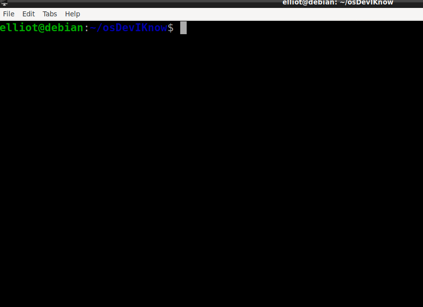

# Desenvolvimento de Sistemas Operacionais
## Sistema: MONOTASK
 
### [*] Funcionalidades Adicionadas:
  - Modo Terminal
  - Leitura de Input do teclado
  - Exibição de cores
  - Novas funções de String
  - Converter ScanCode para Char ASCII
  
### [*] Execução:

